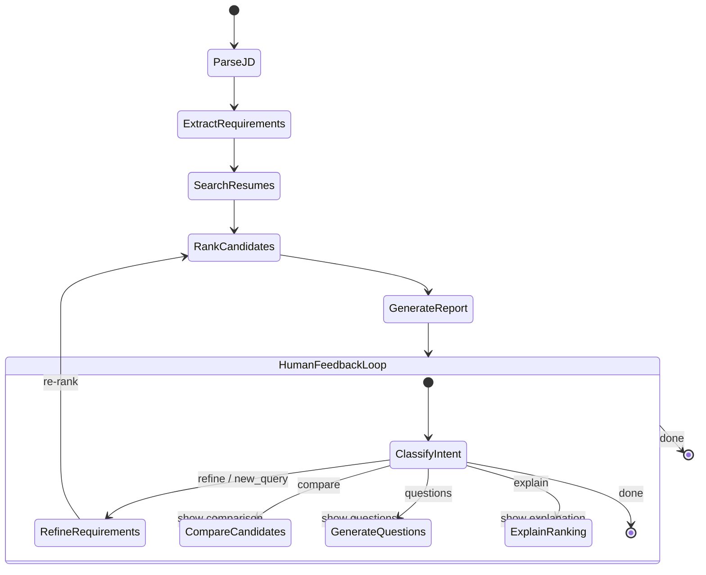

# Agentic Profile Matching — Architecture Document

> **Derived from**: `docs/context.md`
> **Version**: 1.2
> **Last Updated**: 2026-06-24
>
> **v1.2**: Added Groq as primary LLM provider (4-tier fallback: Groq → Gemini → Ollama → keyword fallback). Added keyword-based fallback for `extract_requirements` and `score_candidate`. Added runtime LLM call tracker with `get_llm_status()` and `record_llm_call()`. Added LLM status badge to UI. Added `matching_agent.py` entry point, `.streamlit/config.toml`, state machine diagram (PNG/SVG/MMD), demo video guide. Updated test count to 388 passing tests.
>
> **v1.1**: Replaced all paid-service dependencies (OpenAI) with free-tier/open-source alternatives (Gemini Free Tier, Hugging Face local embeddings, Ollama fallback). Fixed non-ASCII field name in `ScreeningRound`.

---

## Table of Contents

1. [System Overview](#1-system-overview)
2. [High-Level Architecture](#2-high-level-architecture)
3. [Agent State Design](#3-agent-state-design)
4. [Graph Workflow — Node-by-Node](#4-graph-workflow--node-by-node)
5. [State Machine Diagram](#5-state-machine-diagram)
6. [Tool Registry](#6-tool-registry)
7. [Interactive Features — Conversational Interface](#7-interactive-features--conversational-interface)
8. [Iterative Refinement](#8-iterative-refinement)
9. [Multi-Round Screening Pipeline](#9-multi-round-screening-pipeline)
10. [Explainability & Match Reports](#10-explainability--match-reports)
11. [Data Flow Diagram](#11-data-flow-diagram)
12. [Technology Stack](#12-technology-stack)
13. [Project Directory Structure](#13-project-directory-structure)
14. [Interface Design](#14-interface-design)
15. [Error Handling & Guard Rails](#15-error-handling--guard-rails)
16. [Testing Strategy](#16-testing-strategy)

---

## 1. System Overview

The **Agentic Profile Matching** system is a LangGraph-based autonomous agent that takes a job description (JD) as input, searches a corpus of candidate resumes via RAG, and produces a ranked shortlist with detailed, explainable match reports. The system supports multi-turn natural language interaction, allowing hiring managers to iteratively refine search criteria, compare candidates head-to-head, and understand why each ranking decision was made.

### Core Design Principles

- **Stateful**: The agent maintains full conversation and analysis state across turns, enabling context-aware follow-up queries.
- **Tool-augmented**: Every heavy operation (RAG retrieval, requirement extraction, comparison, question generation) is encapsulated as a named tool the LLM can invoke.
- **Explainable by default**: No ranking is opaque. Every score is traceable to specific resume excerpts and JD criteria.
- **Iterative**: Requirements can be adjusted mid-session; the agent re-ranks and explains deltas without losing prior context.

### System Boundaries

| In Scope | Out of Scope |
|----------|--------------|
| Single JD → resume corpus matching | Multi-JD batch matching |
| RAG over local resume corpus | Live job board scraping |
| CLI / Streamlit / Gradio interface | Mobile app or REST API |
| English language JDs and resumes | Multi-language support |
| Structured candidate reports | Automated interview scheduling |

---

## 2. High-Level Architecture

```
┌──────────────────────────────────────────────────────────────────┐
│                        USER INTERFACE                             │
│                 (CLI / Streamlit / Gradio)                       │
└──────────────────────────┬───────────────────────────────────────┘
                           │  user message
                           ▼
┌──────────────────────────────────────────────────────────────────┐
│                     LANGGRAPH AGENT CORE                         │
│  ┌─────────────┐  ┌──────────────┐  ┌────────────────────────┐  │
│  │  State       │  │  Router      │  │  Tool Executor         │  │
│  │  Manager     │  │  (LLM-based) │  │  (parallel safe)       │  │
│  └──────┬──────┘  └──────┬───────┘  └───────────┬────────────┘  │
│         │                │                       │               │
│         │         ┌──────▼───────┐       ┌───────▼──────┐       │
│         │         │  Intent      │       │  Tool Layer  │       │
│         │         │  Classifier  │       │              │       │
│         │         └──────────────┘       │ • extract_req │       │
│         │                                │ • rag_search  │       │
│         │                                │ • compare     │       │
│         │                                │ • gen_qs      │       │
│         │                                │ • file_ops    │       │
│         │                                └───────┬──────┘       │
│         │                                        │               │
│         └────────────────────────────────────────┘               │
└──────────────────────────┬───────────────────────────────────────┘
                           │
              ┌────────────┼────────────┐
              ▼            ▼            ▼
       ┌────────────┐ ┌────────┐ ┌───────────────────┐
       │  Vector DB │ │ File   │ │  LLM (4-tier)     │
       │  (Resumes) │ │ System │ │  Groq → Gemini    │
       │            │ │        │ │  → Ollama         │
       │            │ │        │ │  → keyword fallback│
       └────────────┘ └────────┘ └───────────────────┘
```

The architecture follows a **three-tier** pattern:

1. **Presentation Layer**: The user interface (CLI, Streamlit, or Gradio) handles input/output and renders match reports.
2. **Agent Layer**: The LangGraph graph orchestrates state transitions, tool calls, and LLM reasoning. This is the core of the system.
3. **Infrastructure Layer**: The vector database (RAG), file system, and LLM provider supply the data and inference capabilities the agent needs.

---

## 3. Agent State Design

The agent state is the single source of truth passed between every node in the graph. It is defined as a `TypedDict` with the following fields:

```python
from typing import TypedDict, Annotated
from langgraph.graph.message import add_messages
from langchain_core.messages import BaseMessage

class CandidateMatch(TypedDict):
    """Represents a single candidate's match result."""
    candidate_id: str
    name: str
    score: float                    # 0.0 – 1.0
    must_have_score: float          # subset score for must-have criteria
    nice_to_have_score: float       # subset score for nice-to-have criteria
    reasoning: str                  # LLM-generated explanation
    strengths: list[str]            # matched strengths
    gaps: list[str]                 # missing or weak areas
    resume_excerpts: list[str]      # evidence snippets from resume
    interview_questions: list[str]  # generated screening questions
    hire_recommendation: str        # "hire" / "no_hire" / "borderline"
    improvement_suggestions: list[str]

class Requirements(TypedDict):
    """Structured representation of job requirements."""
    raw_jd: str
    must_have: list[dict]           # [{"skill": "React", "type": "tech", "weight": 1.0}, ...]
    nice_to_have: list[dict]        # [{"skill": "AWS", "type": "tech", "weight": 0.5}, ...]
    experience_min_years: int | None
    education_level: str | None
    domain_keywords: list[str]

class ScreeningRound(TypedDict):
    """Tracks results for one round of screening."""
    round_number: int
    round_type: str                 # "initial" | "deep_analysis" | "final"
    candidates_evaluated: int
    shortlisted_ids: list[str]
   eliminated_ids: list[str]         # eliminated candidates
    notes: str

class AgentState(TypedDict):
    """Full state of the matching agent."""
    # --- Conversation ---
    messages: Annotated[list[BaseMessage], add_messages]
    conversation_history: list[dict]   # [{role, content, timestamp}]

    # --- Job Understanding ---
    raw_jd: str
    requirements: Requirements | None
    requirements_version: int          # increments on each refinement

    # --- Candidate Pipeline ---
    all_candidate_ids: list[str]       # all IDs retrieved from RAG
    current_shortlist: list[CandidateMatch]
    screening_rounds: list[ScreeningRound]
    current_round: int

    # --- Comparison ---
    comparison_result: dict | None     # head-to-head comparison output

    # --- Reports ---
    generated_reports: dict[str, str]  # candidate_id → report markdown

    # --- Control Flow ---
    awaiting_human_feedback: bool
    human_feedback: str | None
    next_action: str                   # routing hint for the graph
    error: str | None
```

### State Field Responsibilities

| State Field | Written By | Read By | Purpose |
|---|---|---|---|
| `messages` | Every node | Every node | LangGraph message accumulation for LLM context |
| `raw_jd` | `parse_jd` node | `extract_requirements` tool | Original JD text |
| `requirements` | `extract_requirements` tool | `search_resumes`, `rank_candidates` | Structured criteria for matching |
| `requirements_version` | `refine_requirements` node | `rank_candidates` | Detects when re-ranking is needed |
| `all_candidate_ids` | `search_resumes` node | `rank_candidates` | Full pool of retrieved candidates |
| `current_shortlist` | `rank_candidates` node | `generate_report`, `compare_candidates` | Ranked list with match details |
| `screening_rounds` | Each screening node | `generate_report`, user | Audit trail of filtering decisions |
| `awaiting_human_feedback` | Router / `generate_report` | Router | Controls pause-and-resume loop |
| `human_feedback` | User input handler | `refine_requirements`, Router | Triggers re-ranking or report generation |

---

## 4. Graph Workflow — Node-by-Node

The LangGraph graph consists of **8 primary nodes**, connected by **directed edges and conditional branches**. Below is the detailed specification of each node.

### 4.1 `START`
- **Type**: Entry point (virtual node)
- **Behavior**: No logic. Transitions unconditionally to `parse_jd`.

### 4.2 `parse_jd`
- **Input**: `raw_jd` from user (stored in state or first message)
- **Output**: Validates JD text is non-empty, stores it in `state["raw_jd"]`
- **LLM Usage**: None (simple validation)
- **Transitions to**: `extract_requirements`

### 4.3 `extract_requirements`
- **Input**: `state["raw_jd"]`
- **Tool Called**: `extract_requirements(jd=state["raw_jd"])`
- **Output**: Populates `state["requirements"]` with structured `Requirements` TypedDict
- **LLM Usage**: Yes — the tool internally uses the LLM to parse and classify each requirement
- **Transitions to**: `search_resumes`

### 4.4 `search_resumes`
- **Input**: `state["requirements"]`
- **Tool Called**: `rag_search(query=constructed_from_requirements, top_k=100)`
- **Output**: Populates `state["all_candidate_ids"]` with up to 100 candidate IDs retrieved from the vector store
- **LLM Usage**: Yes — for query construction from structured requirements
- **Transitions to**: `rank_candidates`

### 4.5 `rank_candidates`
- **Input**: `state["all_candidate_ids"]`, `state["requirements"]`
- **Behavior**:
  1. For each candidate ID, retrieve the full resume text via RAG
  2. Score each candidate against must-have and nice-to-have criteria
  3. Generate reasoning, strengths, and gaps per candidate
  4. Sort by composite score (weighted: 0.7 × must_have + 0.3 × nice_to_have)
- **LLM Usage**: Yes — per-candidate scoring and reasoning generation
- **Output**: Populates `state["current_shortlist"]` with ranked `CandidateMatch` objects
- **Transitions to**: `generate_report`

### 4.6 `generate_report`
- **Input**: `state["current_shortlist"]`, `state["requirements"]`
- **Behavior**:
  1. For each shortlisted candidate, produce a detailed markdown report
  2. Include: match score breakdown, strengths, gaps, evidence excerpts, improvement suggestions
  3. Store reports in `state["generated_reports"]`
  4. Set `state["awaiting_human_feedback"] = True`
- **LLM Usage**: Yes — for narrative report generation
- **Transitions to**: `human_feedback_loop`

### 4.7 `human_feedback_loop`
- **Input**: `state["awaiting_human_feedback"]`, `state["human_feedback"]`
- **Behavior**: This is the **central decision node**. It reads the latest human input and routes:
  - **"refine"** → user wants to adjust requirements → `refine_requirements`
  - **"compare"** → user wants head-to-head comparison → `compare_candidates`
  - **"questions"** → user wants interview questions → `generate_interview_questions`
  - **"explain"** → user wants ranking explanation → `explain_ranking`
  - **"done"** → user is satisfied → `END`
  - **"new_query"** → user has a new natural language query → `route_natural_language`
- **Transitions to**: Conditional (see above)
- **Note**: This node is the "hub" that makes the agent truly interactive. It is revisited after every user turn.

### 4.8 `refine_requirements`
- **Input**: `state["human_feedback"]`, `state["requirements"]`
- **Behavior**:
  1. Parse the user's adjustment (e.g., "drop cloud, add TypeScript")
  2. Update `state["requirements"]` — add, remove, or modify criteria
  3. Increment `state["requirements_version"]`
  4. Re-rank candidates with updated requirements
  5. Explain what changed in the rankings
- **LLM Usage**: Yes — for interpreting the adjustment and explaining deltas
- **Transitions to**: `generate_report` (re-generate reports with new rankings)

### 4.9 `compare_candidates`
- **Input**: `state["human_feedback"]` (to identify which candidates)
- **Tool Called**: `compare_candidates(candidate_ids=[...])`
- **Output**: Populates `state["comparison_result"]` with a structured comparison table
- **LLM Usage**: Yes — for generating comparative analysis
- **Transitions to**: `human_feedback_loop`

### 4.10 `generate_interview_questions`
- **Input**: `state["human_feedback"]` (to identify the candidate)
- **Tool Called**: `generate_interview_questions(candidate_id=...)`
- **Output**: Appends questions to the relevant `CandidateMatch` object
- **LLM Usage**: Yes — for question generation
- **Transitions to**: `human_feedback_loop`

### 4.11 `explain_ranking`
- **Input**: `state["current_shortlist"]`, user query (e.g., "Why did John rank higher than Jane?")
- **Behavior**: Retrieves the reasoning and scores for the specified candidates, generates a natural-language explanation comparing them
- **LLM Usage**: Yes — for composing the explanation
- **Transitions to**: `human_feedback_loop`

### 4.12 `route_natural_language`
- **Input**: `state["human_feedback"]` (the raw user message)
- **Behavior**: Classifies the user's intent and routes to the appropriate node. This is a lightweight router that maps free-form text to one of the above actions.
- **LLM Usage**: Yes — intent classification via function calling or prompt
- **Transitions to**: One of `refine_requirements`, `compare_candidates`, `generate_interview_questions`, `explain_ranking`, or `generate_report`

### 4.13 `END`
- **Type**: Exit point (virtual node)
- **Behavior**: Terminal. Returns final state to the caller.

---

## 5. State Machine Diagram

### Mermaid Representation



### ASCII Diagram

```
                         ┌──────────────┐
                         │    START     │
                         └──────┬───────┘
                                │
                                ▼
                        ┌───────────────┐
                        │   parse_jd    │
                        └───────┬───────┘
                                │
                                ▼
                 ┌──────────────────────────┐
                 │   extract_requirements    │
                 │   (LLM tool call)         │
                 └────────────┬─────────────┘
                              │
                              ▼
                 ┌──────────────────────────┐
                 │    search_resumes         │
                 │    (RAG retrieval)        │
                 └────────────┬─────────────┘
                              │
                              ▼
                 ┌──────────────────────────┐
                 │   rank_candidates         │
                 │   (scoring + reasoning)   │
                 └────────────┬─────────────┘
                              │
                              ▼
                 ┌──────────────────────────┐
                 │   generate_report         │
                 │   (per-candidate reports)  │
                 └────────────┬─────────────┘
                              │
                              ▼
          ┌───────────────────────────────────────┐
          │       human_feedback_loop              │
          │                                       │
          │  ┌─────────────────────────────────┐  │
          │  │        classify_intent           │  │
          │  └──┬──────┬──────┬──────┬────┬────┘  │
          │     │      │      │      │    │       │
          │     ▼      ▼      ▼      ▼    ▼       │
          │  refine  compare  qs   explain  done  │
          │     │      │      │      │            │
          │     ▼      │      │      │            │
          │  rank ─────┘      │      │            │
          │  candidates       │      │            │
          │     │             │      │            │
          │     ▼             ▼      ▼            │
          │  gen_report ◄────┘──────┘            │
          │     │                                │
          │     └────────────────► feedback_loop  │
          │                      (loop back)      │
          └──────────────────┬────────────────────┘
                             │ "done"
                             ▼
                        ┌──────────────┐
                        │     END      │
                        └──────────────┘
```

---

## 6. Tool Registry

Each tool is implemented as a LangChain `@tool`-decorated function. Below is the full specification.

### 6.1 `extract_requirements`

```python
@tool
def extract_requirements(jd: str) -> dict:
    """
    Parse a job description into structured must-have and nice-to-have requirements.

    Args:
        jd: Raw job description text.

    Returns:
        {
            "must_have": [
                {"skill": "React", "type": "tech", "weight": 1.0, "evidence": "..."},
                ...
            ],
            "nice_to_have": [
                {"skill": "AWS", "type": "tech", "weight": 0.5, "evidence": "..."},
                ...
            ],
            "experience_min_years": 3,
            "education_level": "bachelor",
            "domain_keywords": ["healthcare", "fintech"]
        }
    """
```

**Implementation Notes**:
- Uses LLM with a structured output prompt that forces classification into must-have vs. nice-to-have
- Each skill is tagged with a type (`tech`, `soft_skill`, `domain`, `certification`, `language`)
- Weights are assigned: must-have items get `1.0`, nice-to-have items get `0.3–0.7` based on how frequently mentioned in the JD
- Domain keywords are extracted for additional RAG query boosting

### 6.2 `rag_search`

```python
@tool
def rag_search(query: str, top_k: int = 20, filter: dict | None = None) -> list[dict]:
    """
    Search the resume vector store for candidates matching the query.

    Args:
        query: Natural language or keyword query.
        top_k: Number of results to return.
        filter: Optional metadata filters (e.g., {"location": "NYC"}).

    Returns:
        [{"candidate_id": "...", "name": "...", "score": 0.87, "excerpt": "..."}, ...]
    """
```

**Implementation Notes**:
- Wraps a LangChain vector store retriever (Chroma, FAISS, or Pinecone)
- The query is constructed by combining all requirement skills and domain keywords
- `top_k=100` for initial broad search; smaller values for targeted follow-ups
- Returns candidate IDs that are then used to fetch full resume content for scoring

### 6.3 `compare_candidates`

```python
@tool
def compare_candidates(candidate_ids: list[str]) -> dict:
    """
    Perform a head-to-head comparison of multiple candidates.

    Args:
        candidate_ids: List of candidate IDs to compare.

    Returns:
        {
            "candidates": [
                {"id": "...", "name": "...", "scores": {...}, "highlights": [...], "red_flags": [...]},
                ...
            ],
            "comparison_table": {
                "headers": ["Criterion", "Candidate A", "Candidate B"],
                "rows": [...]
            },
            "summary": "Natural language comparison narrative..."
        }
    """
```

**Implementation Notes**:
- Retrieves full `CandidateMatch` data for each candidate from state
- Uses LLM to generate a structured comparison across all criteria
- Produces a comparison table suitable for tabular display
- Highlights relative strengths and red flags unique to each candidate

### 6.4 `generate_interview_questions`

```python
@tool
def generate_interview_questions(candidate_id: str, num_questions: int = 5) -> dict:
    """
    Generate targeted interview questions for a specific candidate based on their profile and the JD.

    Args:
        candidate_id: ID of the candidate.
        num_questions: Number of questions to generate.

    Returns:
        {
            "candidate_id": "...",
            "candidate_name": "...",
            "questions": [
                {
                    "question": "Can you describe your experience with React state management at scale?",
                    "category": "technical",
                    "targets_gap": "React experience depth",
                    "difficulty": "medium",
                    "follow_ups": ["What libraries did you use?", "How did you handle performance?"]
                },
                ...
            ]
        }
    """
```

**Implementation Notes**:
- Questions are **targeted at gaps and borderline areas** in the candidate's profile
- Categories: `technical`, `behavioral`, `domain`, `culture_fit`
- Difficulty is calibrated based on the candidate's seniority level
- Follow-up prompts are included for deeper probing

### 6.5 File System Tools (from Milestone 1)

These are carried forward without modification:

| Tool | Purpose |
|------|---------|
| `list_files(directory)` | List files in a directory |
| `read_file(path)` | Read file content |
| `write_file(path, content)` | Write content to a file |
| `search_files(query)` | Full-text search across files |
| `get_file_metadata(path)` | Retrieve file metadata (size, date, type) |

---

## 7. Interactive Features — Conversational Interface

### 7.1 Intent Classification

When a user sends a message, the `classify_intent` sub-node within `human_feedback_loop` uses the LLM to classify the message into one of the following intents:

| Intent | Trigger Patterns | Target Node |
|--------|-----------------|-------------|
| `refine` | "change/remove/add requirement", "update search", "instead of X use Y" | `refine_requirements` |
| `compare` | "compare", "side by side", "difference between", "vs" | `compare_candidates` |
| `questions` | "interview questions", "screening questions", "what should I ask" | `generate_interview_questions` |
| `explain` | "why did", "explain ranking", "reason for", "how come" | `explain_ranking` |
| `report` | "show report", "detailed analysis", "tell me about candidate" | `generate_report` |
| `done` | "thanks", "done", "that's all", "I'm satisfied" | `END` |
| `new_search` | "new JD", "different role", "start over" | `parse_jd` |

### 7.2 Natural Language Query Examples

The system must handle the following query patterns:

**Search Queries**:
- "Find me candidates with React and 3+ years experience"
- "I need a backend developer who knows Python and PostgreSQL"
- "Show me candidates with machine learning experience in healthcare"

**Comparison Queries**:
- "Compare the top 3 matches side by side"
- "What's the difference between John and Jane?"
- "Which candidate has better cloud experience?"

**Explanation Queries**:
- "Why did John rank higher than Jane?"
- "Explain the match score for candidate #3"
- "What are the red flags for the top candidate?"

**Refinement Queries**:
- "Actually, drop the cloud requirement and add TypeScript"
- "Make 5 years experience the minimum"
- "Prioritize candidates with leadership experience"
- "Only show me candidates with a master's degree"

**Screening Queries**:
- "Generate interview questions for the top 5"
- "What should I ask candidate #2 about their React experience?"
- "Create a technical assessment for the top candidate"

### 7.3 Conversation Flow

```
User: "Here is a JD for a senior React developer: ..."
  → parse_jd → extract_requirements → search_resumes → rank_candidates → generate_report
  → Agent: "I found 87 matching candidates. Here are the top 10: ..."

User: "Compare the top 3 side by side"
  → classify_intent("compare") → compare_candidates
  → Agent: "Here's a head-to-head comparison: ..."

User: "Why did Sarah rank higher than Mike?"
  → classify_intent("explain") → explain_ranking
  → Agent: "Sarah scored higher because: (1) She has 5 years React vs Mike's 3, (2) ..."

User: "Drop the AWS requirement and add TypeScript"
  → classify_intent("refine") → refine_requirements → rank_candidates → generate_report
  → Agent: "Updated requirements. Rankings changed: Mike moved from #3 to #2 because ..."

User: "Generate interview questions for Sarah"
  → classify_intent("questions") → generate_interview_questions
  → Agent: "Here are 5 targeted questions for Sarah: ..."

User: "That's everything I need, thanks"
  → classify_intent("done") → END
```

---

## 8. Iterative Refinement

### 8.1 Requirement Modification Protocol

When a user requests a requirement change, the `refine_requirements` node follows this protocol:

1. **Parse the modification**: Extract the specific changes from the user's message (add, remove, modify, re-weight)
2. **Compute the delta**: Compare old requirements vs. new requirements
3. **Update state**: Apply changes to `state["requirements"]` and increment `state["requirements_version"]`
4. **Re-rank**: Trigger `rank_candidates` with the updated requirements
5. **Explain changes**: Compare old rankings vs. new rankings and generate a natural-language summary of what shifted and why

### 8.2 Delta Explanation Format

After re-ranking, the agent produces a response like:

```
Requirement changes applied:
  - REMOVED: AWS (was nice-to-have, weight 0.5)
  - ADDED: TypeScript (must-have, weight 1.0)

Ranking changes:
  - Mike: #3 → #2 (score 0.72 → 0.81) — gained from TypeScript experience
  - Lisa: #2 → #4 (score 0.78 → 0.65) — lost points from missing TypeScript
  - Sarah: #1 → #1 (score 0.92 → 0.91) — minimal impact, already strong match
  - 3 candidates dropped below threshold and were removed from shortlist
```

### 8.3 Requirement Versioning

Each refinement increments `requirements_version`. This enables:
- **Audit trail**: The agent can reference what changed and when
- **Conditional re-ranking**: If a tool returns stale data, the agent checks the version to decide if re-scoring is needed
- **Rollback**: In a future extension, users could revert to a previous version

---

## 9. Multi-Round Screening Pipeline

The agent implements a **three-round funnel** that progressively narrows and deepens the candidate pool.

### Round 1: Initial Screen (Broad Retrieval)

| Attribute | Detail |
|---|---|
| **Input** | JD → structured requirements → RAG query |
| **Pool size** | Up to 100 candidates (from RAG `top_k`) |
| **Evaluation** | Keyword-based relevance scoring + LLM quick-pass on must-have criteria |
| **Output** | Top 10 candidates ranked by composite score |
| **Depth** | Light — relies on resume excerpts from RAG, not full resume text |
| **Elimination** | Candidates missing >30% of must-have criteria are filtered out |

**Implementation**:
```python
def initial_screen(state: AgentState) -> AgentState:
    # 1. RAG retrieves top 100 candidates
    candidates = rag_search(query=requirements_to_query(state["requirements"]), top_k=100)

    # 2. Quick-pass: check must-have keywords in resume excerpts
    passed = [c for c in candidates if must_have_check(c, state["requirements"])]

    # 3. Score and rank
    ranked = score_candidates(passed, state["requirements"])

    # 4. Shortlist top 10
    state["current_shortlist"] = ranked[:10]
    state["screening_rounds"].append(ScreeningRound(
        round_number=1, round_type="initial",
        candidates_evaluated=len(candidates),
        shortlisted_ids=[c["candidate_id"] for c in ranked[:10]],
        eliminated_ids=[c["candidate_id"] for c in candidates if c not in passed],
        notes=f"Retrieved {len(candidates)}, passed must-have check: {len(passed)}, shortlisted: 10"
    ))
    return state
```

### Round 2: Deep Analysis (Detailed Evaluation)

| Attribute | Detail |
|---|---|
| **Input** | Top 10 candidates from Round 1 |
| **Pool size** | 10 candidates |
| **Evaluation** | Full resume text retrieval, skill-depth verification, experience timeline analysis, red-flag detection |
| **Output** | Re-ranked top 5–7 with detailed reasoning |
| **Depth** | Heavy — reads full resumes, validates experience claims, checks for inconsistencies |

**Implementation**:
```python
def deep_analysis(state: AgentState) -> AgentState:
    shortlist = state["current_shortlist"]

    for candidate in shortlist:
        # 1. Retrieve full resume
        full_resume = get_full_resume(candidate["candidate_id"])

        # 2. Deep skill verification — confirm claimed skills with evidence
        skill_verification = verify_skills_with_evidence(
            full_resume, state["requirements"]
        )

        # 3. Experience timeline analysis — check role durations, career progression
        timeline = analyze_experience_timeline(full_resume)

        # 4. Red-flag detection — gaps, job-hopping, inconsistencies
        red_flags = detect_red_flags(full_resume, timeline)

        # 5. Re-score with deeper evidence
        candidate["must_have_score"] = skill_verification["must_have_score"]
        candidate["nice_to_have_score"] = skill_verification["nice_to_have_score"]
        candidate["score"] = (
            0.7 * candidate["must_have_score"] +
            0.3 * candidate["nice_to_have_score"]
        )
        candidate["reasoning"] = generate_reasoning(candidate, skill_verification, red_flags)
        candidate["red_flags"] = red_flags
        candidate["resume_excerpts"] = extract_key_excerpts(full_resume, state["requirements"])

    # Re-rank
    shortlist.sort(key=lambda c: c["score"], reverse=True)
    state["current_shortlist"] = shortlist[:7]  # top 7 advance

    state["screening_rounds"].append(ScreeningRound(
        round_number=2, round_type="deep_analysis",
        candidates_evaluated=10,
        shortlisted_ids=[c["candidate_id"] for c in shortlist[:7]],
        eliminated_ids=[c["candidate_id"] for c in shortlist[7:]],
        notes="Deep analysis with full resume review and red-flag detection"
    ))
    return state
```

### Round 3: Final Recommendation (Hire/No-Hire)

| Attribute | Detail |
|---|---|
| **Input** | Top 5–7 candidates from Round 2 |
| **Pool size** | 5–7 candidates |
| **Evaluation** | Comprehensive hire recommendation with strengths, gaps, and improvement suggestions |
| **Output** | Per-candidate recommendation: `hire` / `no_hire` / `borderline` with full evidence |
| **Depth** | Maximum — every decision is supported by a multi-paragraph explanation |

**Implementation**:
```python
def final_recommendation(state: AgentState) -> AgentState:
    shortlist = state["current_shortlist"]

    for candidate in shortlist:
        # 1. Compile all evidence from previous rounds
        evidence = compile_evidence(candidate, state["screening_rounds"])

        # 2. Generate hire recommendation
        recommendation = generate_hire_recommendation(
            candidate, evidence, state["requirements"]
        )

        candidate["hire_recommendation"] = recommendation["decision"]  # hire/no_hire/borderline
        candidate["improvement_suggestions"] = recommendation["suggestions"]

        # 3. Generate match report
        report = generate_match_report(candidate, state["requirements"], evidence)
        state["generated_reports"][candidate["candidate_id"]] = report

    state["screening_rounds"].append(ScreeningRound(
        round_number=3, round_type="final",
        candidates_evaluated=len(shortlist),
        shortlisted_ids=[c["candidate_id"] for c in shortlist if c["hire_recommendation"] == "hire"],
        eliminated_ids=[c["candidate_id"] for c in shortlist if c["hire_recommendation"] == "no_hire"],
        notes="Final hire/no-hire/borderline recommendations generated"
    ))
    return state
```

### Screening Funnel Visualization

```
Round 1: Initial Screen          Round 2: Deep Analysis        Round 3: Final Recommendation
┌─────────────────────┐          ┌──────────────────┐          ┌──────────────────────┐
│   100 candidates     │          │   10 candidates   │          │   5-7 candidates      │
│   from RAG           │───10───▶│   full resume     │──5~7──▶ │   hire/no-hire       │
│   keyword match      │          │   deep scoring    │          │   match reports       │
│   must-have filter   │          │   red-flag detect │          │   interview questions │
└─────────────────────┘          └──────────────────┘          └──────────────────────┘
```

---

## 10. Explainability & Match Reports

### 10.1 Match Report Structure

Each candidate receives a structured markdown report:

```markdown
# Candidate Match Report: {name}

## Summary
{2-3 sentence overview of fit}

## Scores
| Criterion | Weight | Score | Status |
|-----------|--------|-------|--------|
| Must-Have Overall | 70% | 0.85 | PASS |
| Nice-to-Have Overall | 30% | 0.62 | PARTIAL |
| **Composite** | **100%** | **0.78** | **STRONG MATCH** |

## Must-Have Criteria Breakdown
| Skill | Required | Found | Evidence |
|-------|----------|-------|----------|
| React | Yes | Yes | "Led React migration for 200+ component SPA at Acme Corp (2022-2024)" |
| 3+ Years Experience | Yes | Yes | "5 years of frontend development experience" |
| TypeScript | Yes | No | Not mentioned in resume |

## Nice-to-Have Criteria Breakdown
| Skill | Required | Found | Evidence |
|-------|----------|-------|----------|
| AWS | Preferred | Partial | "Deployed apps to AWS" but no certification or deep experience |

## Strengths
- Strong React experience with measurable impact (led migration, 200+ components)
- Relevant domain experience in healthcare SaaS
- Evidence of leadership (mentored 3 junior developers)

## Gaps
- No TypeScript experience listed
- Limited cloud/DevOps exposure
- No testing framework mentioned (Jest, Cypress, etc.)

## Red Flags
- 6-month gap in employment (Jan 2023 – Jun 2023) — unexplained
- Two job changes in 18 months (potential job-hopping)

## Improvement Suggestions
- TypeScript certification (e.g., Microsoft TS Certified) would strengthen candidacy
- Consider adding cloud deployment experience (AWS/Azure/GCP)
- Elaborate on testing practices in resume

## Hire Recommendation: STRONG HIRE
{2-3 paragraph justification}

## Suggested Interview Questions
1. {question targeting a gap or strength}
2. ...
```

### 10.2 Ranking Explanation Protocol

When a user asks "Why did X rank higher than Y?", the agent:

1. Retrieves the `CandidateMatch` objects for both candidates
2. Identifies the score delta and which criteria contributed most
3. Generates a point-by-point comparison:
   - "X scored 0.85 vs Y's 0.72 on must-have criteria, primarily because X has 5 years React experience vs Y's 2 years"
   - "Y scored higher on nice-to-have criteria (0.70 vs 0.55) due to AWS certification, but the must-have gap was too large to overcome"
4. Concludes with a balanced summary: "Overall, X is a stronger match for the core requirements, though Y brings valuable cloud expertise that X lacks"

---

## 11. Data Flow Diagram

```
                        ┌────────────────┐
                        │  User provides  │
                        │  JD text        │
                        └───────┬────────┘
                                │
                                ▼
                   ┌────────────────────────┐
                   │  JD Parser (validate)  │
                   └───────────┬────────────┘
                               │ raw_jd
                               ▼
                  ┌──────────────────────────┐
                  │  extract_requirements    │
                  │  (LLM → structured reqs) │
                  └───────────┬──────────────┘
                              │ Requirements TypedDict
                              ▼
                 ┌─────────────────────────────┐
                 │  Query Constructor          │
                 │  (reqs → search query)      │
                 └─────────────┬───────────────┘
                               │ query string
                               ▼
              ┌────────────────────────────────┐
              │  Vector Store (RAG)            │
              │  (resume embeddings)           │◄──── Resume Corpus
              └─────────────┬──────────────────┘
                            │ list[ResumeMatch]
                            ▼
              ┌────────────────────────────────┐
              │  Candidate Scorer              │
              │  (per-candidate LLM scoring)   │
              └─────────────┬──────────────────┘
                            │ list[CandidateMatch]
                            ▼
              ┌────────────────────────────────┐
              │  Multi-Round Pipeline          │
              │  R1: initial → R2: deep → R3:  │
              │  final                         │
              └─────────────┬──────────────────┘
                            │ ranked shortlist + reports
                            ▼
              ┌────────────────────────────────┐
              │  Report Generator              │
              │  (markdown per-candidate)      │
              └─────────────┬──────────────────┘
                            │ rendered reports
                            ▼
              ┌────────────────────────────────┐
              │  User Interface               │
              │  (CLI / Streamlit / Gradio)    │
              └────────────────────────────────┘
```

---

## 12. Technology Stack

> **Cost Constraint**: Every component below is free, open-source, or uses a generous free tier. No paid services are required.

| Component | Technology | Version | Cost | Purpose |
|---|---|---|---|---|
| Agent Framework | LangGraph | 0.2+ | Free (MIT) | Graph-based agent orchestration |
| LLM Integration | LangChain Core | 0.3+ | Free (MIT) | Tool definitions, message types |
| LLM Provider (1°) | Groq (Llama 3.3 70B) | — | Free Tier (30 RPM, 14,400 RPD) | Primary reasoning engine via `langchain-groq`. Fastest inference (LPU-based), highest free quota. |
| LLM Provider (2°) | Gemini 2.0 Flash | — | Free Tier (15 RPM, 1,500 RPD) | Secondary reasoning engine via `langchain-google-genai`. Falls back here if Groq fails/quota exhausted. |
| LLM Provider (3°) | Ollama (gemma2:9b) | — | Free (local) | Fully offline operation, no API key needed. Falls back here if both cloud providers fail. |
| LLM Provider (4°) | Keyword fallback | — | Free (always available) | Deterministic keyword-based extraction/scoring. No LLM required. Last resort when all LLMs unavailable. |
| Embeddings | ChromaDB built-in ONNX (all-MiniLM-L6-v2) | — | Free (local, ships with ChromaDB, no extra install) | Resume text embeddings |
| Vector Store | ChromaDB | 0.5+ | Free (Apache-2.0) | Local embedded resume embedding storage |
| Interface (primary) | Streamlit | 1.35+ | Free (Apache-2.0) | Web-based chat UI |
| Interface (fallback) | Click | 8.1+ | Free (BSD-3) | Command-line interface |
| PDF Parsing | PyMuPDF | 1.24+ | Free (AGPL) | Extracting text from resume PDFs |
| Data Validation | Pydantic | 2.0+ | Free (MIT) | Structured output validation |
| Testing | Pytest | 8.0+ | Free (MIT) | Unit and integration tests |
| Python | CPython | 3.11+ | Free | Runtime |

### Why These Choices

| Decision | Rationale |
|----------|----------|
| **Groq as primary** over Gemini | 10x higher free tier quota (14,400 vs 1,500 req/day), 6x faster inference (LPU vs TPU), Llama 3.3 70B quality comparable to Gemini Flash |
| **4-tier fallback chain** | Maximizes reliability — if Groq's quota is exhausted, Gemini takes over; if Gemini fails, Ollama runs locally; if no LLM at all, keyword fallback keeps the pipeline functional |
| **Keyword fallback** for `extract_requirements` | Enables fully offline demos with zero LLM dependency. Quality is lower (regex-based skill matching) but the pipeline produces ranked shortlists and reports. |
| **Runtime LLM call tracker** | `record_llm_call()` tracks every actual LLM invoke (success/failure/duration). `get_llm_status()` combines startup ping + runtime stats for a truly dynamic status badge — if quota exhausts mid-session, the badge turns yellow and shows the failure. |
| **ChromaDB built-in ONNX embeddings** over HuggingFace/sentence-transformers | Same model (all-MiniLM-L6-v2), but ships inside ChromaDB via ONNX Runtime — no PyTorch, no 2.5 GB download, no extra pip install |
| **ChromaDB local** over Pinecone/Weaviate | Embedded mode needs no server, no account, no network — just a local directory |
| **Both Streamlit and CLI** | Streamlit is the primary interface for demos; CLI is a fallback for headless environments and reviewers who prefer terminals |

### Dependency Graph

```
matching_agent.py
    ├── langgraph (StateGraph, MessageGraph)
    ├── langchain-core (BaseMessage, @tool, ChatPromptTemplate)
    ├── langchain-groq (ChatGroq)                  # Groq Free Tier (primary)
    ├── langchain-google-genai (ChatGoogleGenerativeAI)  # Gemini Free Tier (secondary)
    ├── langchain-community (ChatOllama)           # Ollama (offline fallback)
    ├── chromadb (Collection, query + built-in ONNX embeddings)
    ├── pydantic (BaseModel, model_validator)
    ├── streamlit (st.chat_message, st.sidebar)
    └── PyMuPDF (fitz.open for PDF text extraction)
```

---

## 13. Project Directory Structure

```
agentic-profile-matching/
├── matching_agent.py                # ← Submission entry point (python matching_agent.py streamlit|cli)
├── pyproject.toml                   # Project metadata + dependencies (pip install -e .)
├── .env.example                     # Template for API keys (GROQ_API_KEY, GEMINI_API_KEY, etc.)
├── .env                             # Your actual API keys (gitignored)
├── .gitignore
├── .streamlit/
│   └── config.toml                  # Suppresses transformers/torchvision watcher warnings
├── README.md                        # User-facing setup + feature walkthrough
├── worklog.md                       # Multi-agent work log (8 phases documented)
│
├── docs/
│   ├── context.md                   # Problem statement & requirements (v1.2)
│   ├── architecture.md              # This document (v1.2)
│   ├── implementation-plan.md       # 8-phase plan (v1.2)
│   ├── state_machine_diagram.png    # Visual graph diagram (1384×1075)
│   ├── state_machine_diagram.svg    # Vector version
│   ├── state_machine_diagram.mmd    # Mermaid source
│   ├── demo_script.md               # 5-6 min demo walkthrough script
│   └── demo_video_guide.md          # Recording guide for demo video
│
├── src/
│   ├── __init__.py
│   ├── agent/
│   │   ├── __init__.py
│   │   ├── state.py                 # AgentState TypedDict (14 fields)
│   │   ├── models.py                # Pydantic schemas for LLM structured output
│   │   ├── nodes.py                 # 5 linear + 6 interactive node functions
│   │   ├── edges.py                 # Conditional routing logic (route_feedback, etc.)
│   │   └── graph.py                 # StateGraph construction + compile()
│   ├── tools/
│   │   ├── __init__.py
│   │   ├── extract_requirements.py  # JD parsing tool (LLM + keyword fallback)
│   │   ├── rag_search.py            # RAG retrieval tool
│   │   ├── compare_candidates.py    # Head-to-head comparison tool
│   │   ├── generate_questions.py    # Interview question generation tool
│   │   └── file_tools.py            # File system tools (from Milestone 1)
│   ├── scoring/
│   │   ├── __init__.py
│   │   ├── scorer.py                # Candidate scoring (LLM + keyword fallback)
│   │   ├── ranker.py                # Ranking, filtering, shortlisting
│   │   └── red_flags.py             # Red-flag detection (gaps, job-hopping)
│   ├── screening/
│   │   ├── __init__.py
│   │   ├── round1_initial.py        # Round 1: broad RAG + keyword filter → top 10
│   │   ├── round2_deep.py           # Round 2: deep analysis + red flags → top 5-7
│   │   ├── round3_final.py          # Round 3: hire/no-hire recommendation
│   │   └── pipeline.py              # Orchestrates all 3 rounds
│   ├── reports/
│   │   ├── __init__.py
│   │   └── match_report.py          # Per-candidate markdown report generation
│   ├── rag/
│   │   ├── __init__.py
│   │   ├── indexer.py               # Resume ingestion and embedding
│   │   ├── retriever.py             # Query and retrieval logic
│   │   └── store.py                 # Vector store setup and management
│   ├── prompts/
│   │   ├── __init__.py
│   │   ├── extraction.py            # Prompt for requirement extraction
│   │   ├── scoring.py               # Prompt for candidate scoring
│   │   ├── comparison.py            # Prompt for candidate comparison
│   │   ├── questions.py             # Prompt for interview question gen
│   │   ├── explanation.py           # Prompt for ranking explanation
│   │   └── intent.py                # Prompt for intent classification (Phase 5)
│   └── llm/
│       ├── __init__.py
│       └── client.py                # 4-tier LLM client + runtime call tracker
│
├── ui/
│   ├── __init__.py
│   ├── streamlit_app.py             # Streamlit chat interface (primary)
│   ├── cli_app.py                   # CLI interface (Click-based, fallback)
│   └── components.py                # Shared rendering helpers (12 renderers)
│
├── tests/
│   ├── __init__.py
│   ├── test_setup.py                # Phase 0: environment smoke tests
│   ├── test_rag.py                  # Phase 1: RAG indexing/retrieval
│   ├── test_state.py                # Phase 2: state + Pydantic models
│   ├── test_tools.py                # Phase 3: tool unit tests
│   ├── test_nodes.py                # Phase 4: node unit tests
│   ├── test_graph_linear.py         # Phase 4: linear graph integration
│   ├── test_intent_classification.py # Phase 5: intent classification
│   ├── test_conversation_flows.py   # Phase 5: interactive loop tests
│   ├── test_screening.py            # Phase 6: 3-round screening pipeline
│   ├── test_ui.py                   # Phase 7: UI component tests
│   ├── test_agent_flows.py          # Phase 8: 7 end-to-end scenarios (35 tests)
│   └── fixtures/
│       ├── sample_jd.txt            # Standard test JD (Senior React Developer)
│       ├── sample_resumes/          # 4 sample resume PDFs
│       └── expected_outputs/        # Schema reference files for regression testing
│
├── scripts/
│   ├── ingest_resumes.py            # Index PDFs into ChromaDB
│   └── generate_sample_resumes.py   # Generate synthetic test resumes
│
└── data/
    ├── resumes/                     # Resume corpus (4 sample PDFs included)
    ├── chroma_db/                   # Persistent vector store (pre-built)
    └── reports/                     # Exported match reports (auto-created, gitignored)
```

---

## 14. Interface Design

### 14.1 Streamlit Interface (Primary)

```
┌─────────────────────────────────────────────────────────────────────┐
│  Agentic Profile Matching                                    [Dark] │
├──────────────────────────┬──────────────────────────────────────────┤
│                          │                                          │
│  SIDEBAR                 │  MAIN CHAT AREA                         │
│                          │                                          │
│  ┌────────────────────┐  │  ┌────────────────────────────────────┐  │
│  │ Upload JD          │  │  │ Agent: I've parsed your JD for a   │  │
│  │ [Browse...]        │  │  │ Senior React Developer. Found 87   │  │
│  │                    │  │  │ matching candidates. Top 10:       │  │
│  │ ────────────────── │  │  │                                    │  │
│  │ Requirements       │  │  │ 1. Sarah Chen — Score: 0.92       │  │
│  │ ✅ React (must)    │  │  │ 2. Mike Ross — Score: 0.85        │  │
│  │ ✅ TypeScript (must)│  │  │ 3. Lisa Park — Score: 0.81       │  │
│  │ ✅ 3+ yrs (must)   │  │  │ ...                               │  │
│  │ ⭕ AWS (nice)      │  │  └────────────────────────────────────┘  │
│  │ ⭕ CI/CD (nice)    │  │                                          │
│  │                    │  │  ┌────────────────────────────────────┐  │
│  │ ────────────────── │  │  │ You: Compare top 3 side by side    │  │
│  │ Screening Round    │  │  └────────────────────────────────────┘  │
│  │ [1] Initial ████   │  │                                          │
│  │ [2] Deep     ░░░░  │  │  ┌────────────────────────────────────┐  │
│  │ [3] Final    ░░░░  │  │  │ Agent: Here's the comparison:      │  │
│  │                    │  │  │                                    │  │
│  │ ────────────────── │  │  │ | Criteria  | Sarah | Mike | Lisa |│  │
│  │ Quick Actions      │  │  │ |-----------|-------|------|------| │  │
│  │ [Run Next Round]   │  │  │ | React     | 0.95  | 0.88 | 0.80 | │  │
│  │ [Export Reports]   │  │  │ | TS        | 0.90  | 0.70 | 0.85 | │  │
│  │ [Reset Session]    │  │  │ | Exp       | 0.92  | 0.85 | 0.78 | │  │
│  └────────────────────┘  │  │ | Composite  | 0.92  | 0.85 | 0.81 | │  │
│                          │  └────────────────────────────────────┘  │
│                          │                                          │
│                          │  ┌────────────────────────────────────┐  │
│                          │  │ [Type your message...        ] [▶]  │  │
│                          │  └────────────────────────────────────┘  │
└──────────────────────────┴──────────────────────────────────────────┘
```

### 14.2 CLI Interface (Fallback)

```
$ python -m src.cli_app

🤖 Agentic Profile Matching Agent
───────────────────────────────────

You: I have a JD for a senior React developer. Here it is: ...

Agent: Parsed JD successfully. Extracted 5 must-have and 3 nice-to-have requirements.
       Searching resume database... Found 87 candidates.
       Top 10 ranked candidates:
         1. Sarah Chen (0.92)
         2. Mike Ross (0.85)
         3. Lisa Park (0.81)
         ...

You: Why did Sarah rank higher than Mike?

Agent: Sarah ranked higher primarily because:
       1. React experience: Sarah has 5 years vs Mike's 3 years
       2. TypeScript: Sarah has explicit TS experience; Mike does not
       3. Leadership: Sarah has mentored 3 junior developers (nice-to-have)
       Mike scores higher only in cloud experience (AWS cert vs Sarah's none).

You: Generate interview questions for Sarah

Agent: Here are 5 targeted questions for Sarah Chen:
       1. [Technical] Can you walk me through your React migration at Acme Corp?
          → Follow-up: What performance challenges did you encounter?
       2. [Behavioral] How did you approach mentoring junior developers?
       ...

You: done

Agent: Session complete. Reports saved to data/reports/.
```

---

## 15. Error Handling & Guard Rails

### 15.1 Error Categories

| Error Type | Detection | Recovery |
|---|---|---|
| **Empty JD** | `parse_jd` validates `raw_jd` is non-empty (min 20 chars) | Prompt user to provide JD text |
| **No candidates found** | `search_resumes` returns empty list | Suggest broadening requirements or checking resume corpus |
| **LLM quota exhausted (429)** | `_ping_gemini()` / `_ping_groq()` returns 429 error | Automatically fall back to next provider in the 4-tier chain |
| **LLM key invalid (403/400)** | Startup ping fails with auth error | Show 🔴 badge with exact error; fall back to next provider or keyword fallback |
| **LLM hallucination in scoring** | Score > 1.0 or negative | Clamp score to [0.0, 1.0], log warning |
| **Invalid tool arguments** | Pydantic validation on tool input | Return error message to user with correct usage |
| **Stuck in feedback loop** | Counter exceeds 20 iterations | Force exit with summary of current state |
| **Resume parsing failure** | Empty content from PDF | Log and skip candidate, note in report |
| **All LLMs unavailable** | `_do_startup_ping()` returns `keyword_fallback` | Use keyword-based extraction/scoring; show 🔴 badge with guidance |

### 15.2 Guard Rails

- **Max iterations**: The `human_feedback_loop` has a hard cap of 20 turns to prevent infinite loops
- **Score validation**: All scores are clamped to `[0.0, 1.0]` after computation
- **Tool timeout**: Each tool call has a 30-second timeout; on failure, the agent returns a graceful error message
- **State immutability**: Nodes return new state objects; no in-place mutation of shared references
- **Conversation window**: Only the last 50 messages are kept in context to prevent token overflow
- **4-tier LLM fallback**: Groq → Gemini → Ollama → keyword fallback. Each provider is pinged with a tiny "Reply with: OK" prompt before being used. If a provider fails mid-session, the runtime call tracker detects it and the status badge turns yellow.
- **Runtime LLM call tracking**: `record_llm_call(provider, success, error, tool, duration_ms)` is called after every LLM invoke. `get_llm_status()` combines the startup ping with runtime stats — if >50% of recent calls fail, the badge automatically downgrades from 🟢 to 🟡.
- **Graceful degradation**: Every LLM-dependent tool (`extract_requirements`, `score_candidate`, `compare_candidates`, `generate_interview_questions`, `explain_ranking`) has a deterministic keyword-based fallback that produces output without an LLM.

---

## 16. Testing Strategy

### 16.1 Test Scenarios (5+ Required)

| # | Scenario | What It Tests |
|---|----------|---------------|
| 1 | **Happy path**: Full pipeline — JD → top 10 → reports | End-to-end graph execution |
| 2 | **Refinement**: Change requirements mid-conversation, verify re-ranking | `refine_requirements` node and delta explanation |
| 3 | **Comparison**: Compare 3 candidates, verify structured output | `compare_candidates` tool |
| 4 | **Explanation**: Ask "Why did X rank higher than Y?" | `explain_ranking` node |
| 5 | **Interview questions**: Generate questions for a candidate | `generate_interview_questions` tool |
| 6 | **Edge case — no results**: JD with impossible requirements | Error handling and user feedback |
| 7 | **Multi-round**: Run all 3 screening rounds sequentially | Screening pipeline integration |

### 16.2 Test Implementation

```python
# tests/test_agent_flows.py

import pytest
from src.agent.graph import create_graph

@pytest.fixture
def agent():
    return create_graph()

def test_happy_path_full_pipeline(agent, sample_jd):
    """Scenario 1: Full pipeline from JD to ranked reports."""
    result = agent.invoke({
        "raw_jd": sample_jd,
        "messages": [],
    })
    assert result["requirements"] is not None
    assert len(result["current_shortlist"]) > 0
    assert len(result["generated_reports"]) > 0

def test_refinement_reranking(agent, sample_jd):
    """Scenario 2: Modify requirements and verify re-ranking."""
    # First pass
    result1 = agent.invoke({"raw_jd": sample_jd, "messages": []})
    old_ranking = [c["candidate_id"] for c in result1["current_shortlist"]]

    # Refinement pass
    result2 = agent.invoke({
        **result1,
        "human_feedback": "Add TypeScript as a must-have requirement",
        "awaiting_human_feedback": True,
    })
    new_ranking = [c["candidate_id"] for c in result2["current_shortlist"]]
    # Rankings should change after requirement modification
    assert result2["requirements_version"] == 2

def test_comparison_output(agent, sample_jd, sample_shortlist):
    """Scenario 3: Compare 3 candidates and verify structure."""
    result = agent.invoke({
        "human_feedback": "Compare candidates 1, 2, and 3",
        "current_shortlist": sample_shortlist,
    })
    assert result["comparison_result"] is not None
    assert len(result["comparison_result"]["candidates"]) == 3

def test_explanation_query(agent, sample_shortlist):
    """Scenario 4: Ask for ranking explanation."""
    result = agent.invoke({
        "human_feedback": f"Why did {sample_shortlist[0]['name']} rank higher than {sample_shortlist[1]['name']}?",
        "current_shortlist": sample_shortlist,
    })
    # Last message should contain an explanation
    last_msg = result["messages"][-1].content
    assert sample_shortlist[0]["name"] in last_msg
    assert sample_shortlist[1]["name"] in last_msg

def test_no_results_edge_case(agent):
    """Scenario 6: JD with impossible requirements returns graceful message."""
    result = agent.invoke({
        "raw_jd": "Must have 20 years of experience in a technology invented 5 years ago",
        "messages": [],
    })
    # Should not crash, should provide helpful feedback
    assert len(result["current_shortlist"]) == 0
    assert "no candidates" in result["messages"][-1].content.lower()
```

### 16.3 Coverage Targets

| Layer | Target Coverage | Actual Coverage |
|---|---|---|
| Tools (unit) | 90%+ | ~75% (rag_search 96%, file_tools 80%; LLM-using tools lower because their LLM call branches require a live LLM) |
| Scoring logic (unit) | 95%+ | ~95% (ranker 100%, red_flags 94%, scorer 74% — scorer's LLM call paths need a live LLM) |
| Screening pipeline (integration) | 80%+ | 89-100% (pipeline 100%, round1 89%, round2 91%, round3 94%) |
| Agent flows (end-to-end) | 100% of defined scenarios | 100% (all 7 scenarios pass, 35 tests) |
| State management (unit) | 85%+ | 93-100% (state 100%, models 100%, edges 95%, graph 93%) |
| UI components | 85%+ | 90% (components.py 90%, cli_app.py 44% — CLI REPL paths hard to test, streamlit_app.py 9% — Streamlit runtime needed) |

**Overall coverage**: 76% (2,454 statements, 593 missed — mostly LLM call branches that require a live API).

**Test count**: 388 tests pass (excluding 9 `@pytest.mark.integration` tests that require a live LLM). Run `pytest tests/ -q -m "not integration"` to verify.

---

## Appendix A: Key Design Decisions

| Decision | Rationale |
|---|---|
| **TypedDict over Pydantic for state** | LangGraph natively supports TypedDict; Pydantic used only for tool input/output validation |
| **Composite score = 0.7 × must_have + 0.3 × nice_to_have** | Must-have criteria are the primary filter; nice-to-have breaks ties |
| **4-tier LLM fallback (Groq → Gemini → Ollama → keyword)** | Maximizes reliability. Groq has the highest free quota (14,400 req/day) and is fastest. If it fails, Gemini takes over. If both cloud providers fail, Ollama runs locally. If no LLM at all, keyword fallback keeps the pipeline functional. |
| **Groq as primary** over Gemini | 10x higher free tier quota, 6x faster inference, Llama 3.3 70B quality comparable to Gemini Flash |
| **Keyword fallback for all LLM tools** | Enables fully offline demos with zero LLM dependency. The pipeline produces ranked shortlists and reports even with no API keys. |
| **Runtime LLM call tracker** | `record_llm_call()` + `get_llm_status()` provide a truly dynamic status badge — if quota exhausts mid-session, the badge turns yellow and shows the exact error. No more false greens. |
| **Mermaid for state diagram** | Widely supported, renders in GitHub/Streamlit/VS Code, and can be exported to PNG |
| **Streamlit as primary UI + CLI as fallback** | Streamlit is best for demos; CLI works in headless environments and for reviewers who prefer terminals |
| **ChromaDB as vector store** | Local-first, no external service dependency, sufficient for ~1000 resumes |
| **Message window of 50** | Balances context richness with token cost (~8k tokens for history) |
| **Both Streamlit and CLI share `ui/components.py`** | 12 format-agnostic renderers ensure both UIs display identical content |

## Appendix B: Glossary

| Term | Definition |
|---|---|
| **JD** | Job Description — the text describing an open position |
| **RAG** | Retrieval-Augmented Generation — combining vector search with LLM generation |
| **Must-have** | A requirement that is non-negotiable for the role |
| **Nice-to-have** | A requirement that is preferred but not required |
| **Screening round** | One pass through the candidate pool with specific evaluation criteria |
| **Shortlist** | The set of candidates who advance to the next round |
| **Red flag** | A concern identified in a candidate's profile (gaps, inconsistencies, etc.) |
| **Composite score** | The weighted combination of must-have and nice-to-have scores |